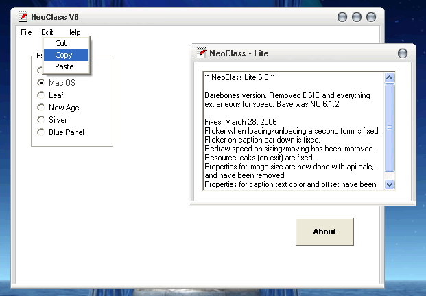



## Final\! NeoClass\! 1\.6\.3 \(updated/fixes/menus demo\)  \- Radical Client Modification Class

### Description

A form skinning class based on vbaccelerators Neocaption component. I rewrote the entire library, and reduced (8 classes and a module of mind numbing coding complexity ;-), to a single, small and efficient class, that can simply be dropped into a project to produce spectacular effects. The first version is fast and stable..

----

V6 is up! Last version. Included the last copy of RCM SC as well. Added owner drawn caption text and icon routines and the new skins. Gave the code a good once over, and made some fixes/improvements.

----

6.2 IS UP!

Fixed a bunch of stuff, flicker problems when a new form is loaded/unloaded is fixed. Painting into controls on resize is fixed. Properties added/removed. Caption text color and offset added. Demo is in a dll, (better for multiple forms). Includes a lite version, (skinner only), full rev w/ fixes, and RCM V4, (version I am still working with..)

Skinned my scheduler and updated that also, as a demo.

Well, enjoy..

Cheers

John
 
### More Info
 

             |
---                |---
**Submitted On**   |2006-03-31 10:41:02
**By**             |[Steppenwolfe](https://github.com/Planet-Source-Code/PSCIndex/blob/master/ByAuthor/steppenwolfe.md)
**Level**          |Intermediate
**User Rating**    |5.0 (145 globes from 29 users)
**Compatibility**  |VB 6\.0
**Category**       |[Complete Applications](https://github.com/Planet-Source-Code/PSCIndex/blob/master/ByCategory/complete-applications__1-27.md)
**World**          |[Visual Basic](https://github.com/Planet-Source-Code/PSCIndex/blob/master/ByWorld/visual-basic.md)
**Archive File**   |[Final\!\_Neo1984333312006\.zip](https://github.com/Planet-Source-Code/steppenwolfe-final-neoclass-1-6-3-updated-fixes-menus-demo-radical-client-modification-cla__1-64357/archive/master.zip)

